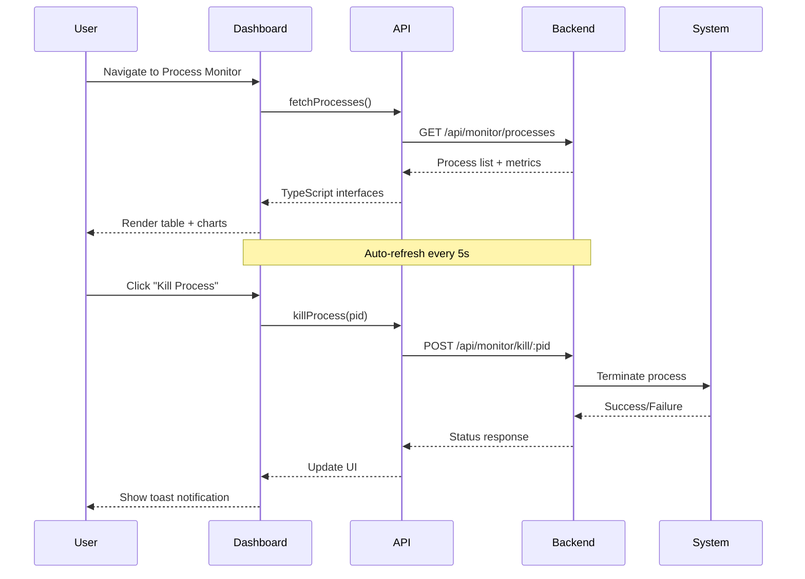
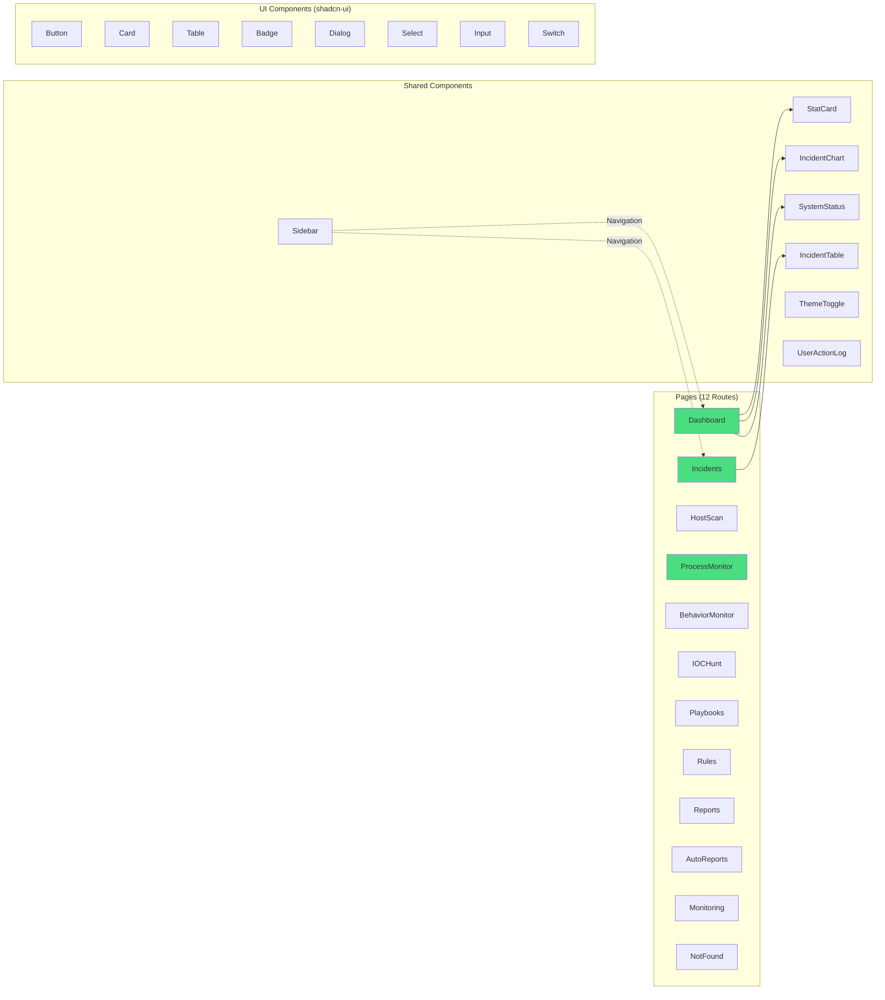
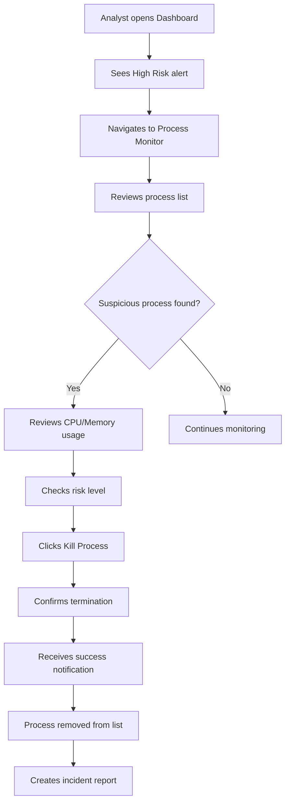

# Threat Sentinel View - Comprehensive System Overview

> **Last Updated**: 2025-11-23  
> **Version**: 1.0  
> **Status**: Development (Mock Backend)

## Table of Contents

1. [Executive Summary](#executive-summary)
2. [System Architecture](#system-architecture)
3. [Technology Stack](#technology-stack)
4. [Feature Analysis](#feature-analysis)
5. [Developer Perspective](#developer-perspective)
6. [Product Perspective](#product-perspective)
7. [Architectural Insights](#architectural-insights)
8. [Scalability & Performance](#scalability--performance)
9. [Security Considerations](#security-considerations)
10. [Future Roadmap](#future-roadmap)
11. [Actionable Recommendations](#actionable-recommendations)

---

## Executive Summary

**Threat Sentinel View** (formerly SecureWatch Pro) is a comprehensive **Security Operations Center (SOC) Dashboard** built as a modern web application for real-time security monitoring, incident response, and threat detection. The platform provides security analysts with powerful tools for:

- 🛡️ **Real-time Process & Behavior Monitoring**
- 🔍 **Host Integrity Scanning** (Baseline deviation detection)
- 🎯 **IOC (Indicator of Compromise) Hunting**
- 📊 **Security Incident Management**
- ⚡ **Automated Response Playbooks**
- 📈 **Security Metrics & Reporting**

### Project Highlights

- **Technology**: Modern React + TypeScript stack with premium UI components
- **Architecture**: Client-server model with RESTful API design
- **Current State**: Fully functional frontend with mock backend
- **Production Readiness**: ~60% (requires Python agent integration)

---

## System Architecture

### High-Level Architecture

```mermaid
graph TB
    subgraph "Frontend Layer"
        UI[React Dashboard<br/>TypeScript + Vite]
        Router[React Router<br/>12 Routes]
        State[State Management<br/>React Query + Hooks]
        UI --> Router
        UI --> State
    end
    
    subgraph "API Layer"
        APIClient[API Client<br/>apiClient.ts]
        MockData[Mock Data Layer]
    end
    
    subgraph "Backend Layer - Current"
        ExpressAPI[Express Server<br/>Port 4000]
        ScanRoute[/api/scan/*<br/>Scan Routes]
        MonitorRoute[/api/monitor/*<br/>Monitor Routes]
        ExpressAPI --> ScanRoute
        ExpressAPI --> MonitorRoute
    end
    
    subgraph "Backend Layer - Planned"
        PythonAgent[Python Security Agent<br/>Port 5001]
        SystemAPIs[OS APIs<br/>psutil, hashlib]
        FileSystem[File System<br/>Scanning]
        PythonAgent -.-> SystemAPIs
        PythonAgent -.-> FileSystem
    end
    
    UI --> APIClient
    APIClient --> ExpressAPI
    APIClient -.->|Future| PythonAgent
    
    style PythonAgent stroke-dasharray: 5 5
    style SystemAPIs stroke-dasharray: 5 5
    style FileSystem stroke-dasharray: 5 5
```

### Data Flow Architecture



### Component Architecture



---

## Technology Stack

### Frontend Technologies

| Category | Technology | Version | Purpose |
|----------|-----------|---------|---------|
| **Framework** | React | 18.3.1 | UI library |
| **Language** | TypeScript | 5.8.3 | Type safety |
| **Build Tool** | Vite | 5.4.19 | Fast bundling & dev server |
| **Routing** | React Router | 6.30.1 | Client-side routing |
| **UI Components** | shadcn-ui | Latest | Pre-built accessible components |
| **Styling** | Tailwind CSS | 3.4.17 | Utility-first CSS |
| **Animations** | Framer Motion | 12.23.24 | Smooth transitions |
| **Charts** | Recharts | 2.15.4 | Data visualization |
| **State** | TanStack Query | 5.83.0 | Server state management |
| **Forms** | React Hook Form | 7.61.1 | Form validation |
| **Icons** | Lucide React | 0.462.0 | Icon library |
| **Themes** | next-themes | 0.3.0 | Dark/light mode |
| **Toasts** | Sonner | 1.7.4 | Notifications |

### Backend Technologies

| Category | Technology | Purpose |
|----------|-----------|---------|
| **Runtime** | Node.js | JavaScript runtime |
| **Framework** | Express.js | RESTful API server |
| **CORS** | cors | Cross-origin requests |
| **Port** | 4000 | Development server |

### Future Backend (Python Agent)

| Technology | Purpose |
|------------|---------|
| Flask | Python web framework |
| psutil | System/process utilities |
| hashlib | File integrity checking |
| Port 5001 | Python agent endpoint |

---

## Feature Analysis

### 1. Security Dashboard 📊

**Route**: `/`  
**Component**: `Dashboard.tsx`

**Capabilities**:
- Real-time security metrics display
- 4 key stat cards: Total Incidents, Active Incidents, Resolved Today, Critical Alerts
- Incident trend chart (time-series visualization)
- System status overview
- Color-coded severity indicators

**UI Components Used**:
- `StatCard` - Reusable metric displays with icons & trends
- `IncidentChart` - Time-series chart using Recharts
- `SystemStatus` - Real-time system health monitoring

### 2. Process Monitor 🔍

**Route**: `/process-monitor`  
**Component**: `ProcessMonitor.tsx`

**Capabilities**:
- Real-time process listing with auto-refresh (5s intervals)
- CPU & Memory usage charts (last 60 seconds)
- Risk assessment per process (Low/Medium/High)
- Process termination capability
- Visual progress bars for CPU usage
- Summary cards: Total Processes, High Risk count, System Load

**Technical Features**:
- Framer Motion animations for smooth UI updates
- AnimatePresence for process list transitions
- Recharts LineChart for metrics visualization
- Polling mechanism with `useEffect`
- Loading skeletons for better UX

**API Endpoints Used**:
```
GET  /api/monitor/processes  → Process list + summary
GET  /api/monitor/metrics    → CPU/Memory time-series
POST /api/monitor/kill/:pid  → Terminate process
```

### 3. Host Scan & Baseline Integrity 🛡️

**Route**: `/host-scan`  
**Component**: `HostScan.tsx`

**Capabilities**:
- Baseline integrity scanning for Windows/Linux hosts
- File system change detection
- Registry key modification tracking
- Hash-based file integrity verification
- Severity scoring (Low/Medium/High)
- Baseline match percentage (0-100%)

**Scan Results Include**:
- New files created
- Modified files with hash differences
- Registry key changes
- Timestamp tracking

**API Endpoints Used**:
```
POST /api/scan/start   → Initiate scan
GET  /api/scan/results → Retrieve scan results
```

### 4. IOC Hunt 🎯

**Route**: `/ioc-hunt`  
**Component**: `IOCHunt.tsx`

**Capabilities**:
- Search for Indicators of Compromise across infrastructure
- Support for multiple IOC types:
  - File hashes (MD5, SHA1, SHA256)
  - IP addresses
  - Domain names
  - File paths
- Cross-host search results
- Evidence location tracking
- First-seen timestamps

### 5. Security Incidents 🚨

**Route**: `/incidents`  
**Component**: `Incidents.tsx`

**Capabilities**:
- Incident listing with search & filters
- Severity-based filtering (Critical/High/Medium/Low)
- Real-time notifications via WebSocket (planned)
- Incident detail views
- Status tracking (Open/In Progress/Resolved/Closed)

**Components**:
- `IncidentTable` - Main incident listing
- `useNotifications` hook - Real-time updates

### 6. Auto-Containment Playbooks ⚡

**Route**: `/playbooks`  
**Component**: `Playbooks.tsx`

**Capabilities**:
- Automated response workflow management
- 3 execution modes:
  - **Suggest Only** - Recommend actions to analyst
  - **Semi-Auto** - Require approval before execution
  - **Full-Auto** - Execute automatically on trigger
- Playbook actions:
  - Isolate host
  - Kill process
  - Collect evidence (memory dump, disk image)
  - Block IP/domain
  - Reset credentials
  - Notify analyst
- Enable/disable playbooks via toggle
- Manual execution with real-time results
- Trigger condition configuration

**Example Playbooks**:
1. **Ransomware Response** (Semi-Auto)
   - Isolate host → Kill process → Collect memory dump
2. **C2 Communication Block** (Full-Auto)
   - Block IP → Isolate host → Notify analyst
3. **Privilege Escalation Response** (Suggest)
   - Kill process → Collect evidence → Reset credentials

### 7. Reports & Auto-Reports 📄

**Routes**: `/reports`, `/auto-reports`

**Capabilities**:
- Incident report generation
- PDF export
- Summary, impact, and recommendations sections
- Automated report scheduling (planned)
- Executive summary generation

---

## Developer Perspective

### Code Architecture Analysis

#### Strengths ✅

1. **Type Safety**
   - Full TypeScript implementation with strict types
   - Well-defined interfaces for all data models (`ScanJob`, `BehaviorEvent`, `Playbook`, etc.)
   - Type-safe API client with Promise-based returns

2. **Component Organization**
   - Clear separation of concerns: `pages/`, `components/`, `hooks/`, `api/`, `lib/`
   - Reusable UI components from shadcn-ui
   - Custom hooks for shared logic (`useNotifications`, `useBehaviorStream`, `use-toast`, `use-mobile`)

3. **Modern React Patterns**
   - Functional components with hooks
   - Custom hooks for business logic
   - React Query for server state management
   - Proper effect cleanup in `useEffect`

4. **UI/UX Excellence**
   - Framer Motion for smooth animations
   - Loading states with Skeletons
   - Toast notifications for user feedback
   - Dark/light theme support via `next-themes`
   - Responsive design with Tailwind breakpoints

5. **Code Quality**
   - ESLint configuration with React rules
   - Consistent code style
   - Utility functions in `lib/utils.ts` (cn helper for classnames)
   - Mock data organization in separate files

#### Areas for Improvement ⚠️

1. **API Client Design**
   - All API calls currently use mock data
   - TODO comments indicate planned real backend integration
   - No error boundary implementation
   - Missing retry logic for failed requests

2. **State Management**
   - Heavy reliance on local component state
   - No global state management (Redux/Zustand/Jotai)
   - Could benefit from context providers for shared state

3. **Testing**
   - No test files detected in the codebase
   - Missing unit tests for components
   - No integration tests for API flows
   - No E2E tests

4. **Authentication & Authorization**
   - No authentication system implemented
   - No route protection
   - No user management
- No role-based access control (RBAC)

5. **Backend Architecture**
   - Mock backend with hardcoded data
   - No database integration
   - No WebSocket implementation for real-time updates
   - No logging/monitoring infrastructure

### File Structure

```
threat-sentinel-view/
├── src/
│   ├── api/
│   │   └── apiClient.ts          # Centralized API client (mock implementations)
│   ├── components/
│   │   ├── dashboard/            # Dashboard-specific components
│   │   ├── incidents/            # Incident management components
│   │   ├── layout/               # Layout components
│   │   └── ui/                   # shadcn-ui components (60 components)
│   ├── hooks/
│   ├── lib/
│   ├── pages/                    # 12 route pages
│   ├── App.tsx                   # Main app component with routing
│   ├── main.tsx                  # Entry point
│   └── index.css                 # Global styles + Tailwind imports
├── backend/
│   ├── routes/
│   ├── mock/
│   ├── server.js
│   └── README.md
└── package.json
```

### Design Patterns Identified

1. **Container/Presentational Pattern**
2. **Custom Hooks Pattern**
3. **Composition Pattern**
4. **Provider Pattern**
5. **Polling Pattern**

---

## Product Perspective

### Target Users

1. **Security Operations Center (SOC) Analysts**
2. **Incident Responders**
3. **Security Engineers**
4. **Management/Leadership**

### User Flows

#### Flow 1: Detecting & Responding to Suspicious Process



---

## Scalability & Performance

### Scalability Concerns & Solutions

1. **Frontend Rendering Performance** - Implement virtualization for large tables
2. **Polling Overhead** - Migrate to WebSocket for real-time updates
3. **API Response Size** - Implement pagination and compression
4. **State Management at Scale** - Introduce Zustand for global state
5. **Backend Scalability** - Microservices architecture with message queue

---

## Security Considerations

### ❌ Missing Critical Security Features

1. **No Authentication** - Anyone can access the dashboard
2. **No Authorization** - No RBAC implementation
3. **No API Security** - No rate limiting, validation
4. **No Data Encryption** - HTTP traffic not encrypted
5. **No Input Validation** - Frontend validation only

### Security Recommendations (Priority Order)

#### 🔴 Critical (Implement Before Production)

1. Authentication System (OAuth2/SAML + JWT + MFA)
2. HTTPS/TLS enforcement
3. API Security (keys, rate limiting, validation)
4. Authorization (RBAC)

#### 🟡 High Priority

5. Input Validation & Sanitization
6. Audit Logging
7. Secrets Management

---

## Future Roadmap

### Phase 1: Backend Integration (1-2 months)

- Python Flask agent with psutil integration
- PostgreSQL database schema
- JWT authentication system
- WebSocket server for real-time updates
- Unit test coverage >70%

### Phase 2: Advanced Features (2-3 months)

- Network Monitoring
- Threat Intelligence Integration
- Machine Learning (anomaly detection)
- Forensics Tools

### Phase 3: Enterprise Features (3-6 months)

- Multi-Tenancy
- Advanced Reporting
- Integration Ecosystem (SIEM, Ticketing, EDR)
- High Availability

---

## Actionable Recommendations

### For Software Architects 🏗️

1. **Database Schema Design** - Design PostgreSQL schema with TimescaleDB for time-series
2. **API Gateway Implementation** - Add Kong/AWS API Gateway for rate limiting
3. **Microservices Migration Path** - Extract scan/monitor services
4. **Observability Stack** - Prometheus + Grafana + ELK

### For Software Developers 💻

1. **Testing Infrastructure** - Add Vitest, Testing Library, MSW
2. **Code Quality Tools** - Husky, ESLint, Prettier
3. **Performance Optimizations** - Code splitting, bundle analysis, virtual scrolling
4. **Error Handling** - Error Boundaries, Sentry integration

### For Product Managers 📈

1. **User Research Priorities** - Conduct usability testing with SOC analysts
2. **Feature Prioritization** - Auth (must-have), Network monitoring (should-have)
3. **Metrics & KPIs** - Track MTTD, MTTR, false positive rate
4. **Go-to-Market Strategy** - Target SMB SOC teams, freemium model

### For DevOps Engineers 🚀

1. **Containerization** - Create multi-stage Dockerfile
2. **CI/CD Pipeline** - GitHub Actions with automated deployment
3. **Infrastructure as Code** - Terraform for cloud resources
4. **Monitoring & Alerting** - Uptime monitoring, error rate alerts

---

## Conclusion

**Threat Sentinel View** is a well-architected, modern SOC dashboard with significant potential:

✅ **Strong Foundation**: TypeScript, React, modern tooling  
✅ **Excellent UI/UX**: Premium components, smooth animations, dark mode  
✅ **Clear Architecture**: Separation of concerns, reusable components  
✅ **Comprehensive Features**: 12 major security monitoring capabilities  

**Critical Next Steps**:
1. Implement authentication & authorization
2. Replace mock backend with Python agent
3. Add comprehensive testing
4. Deploy to staging environment

**Estimated Timeline to Production**: 3-4 months with a 2-3 person team.

---

## Quick Reference

### Development Commands

```bash
# Frontend Development
npm install           # Install dependencies
npm run dev           # Start dev server (http://localhost:5173)
npm run build         # Production build
npm run preview       # Preview production build

# Backend Development
cd backend
npm install           # Install backend dependencies
npm start             # Start backend server (http://localhost:4000)
```

### Key Files to Review

- [src/api/apiClient.ts](src/api/apiClient.ts) - API client with all endpoints
- [src/App.tsx](src/App.tsx) - Main routing configuration
- [tailwind.config.ts](tailwind.config.ts) - Theme customization
- [backend/README.md](backend/README.md) - Backend integration guide

---

**Document Version**: 1.0  
**Generated**: 2025-11-23  
**Author**: Comprehensive Codebase Analysis
